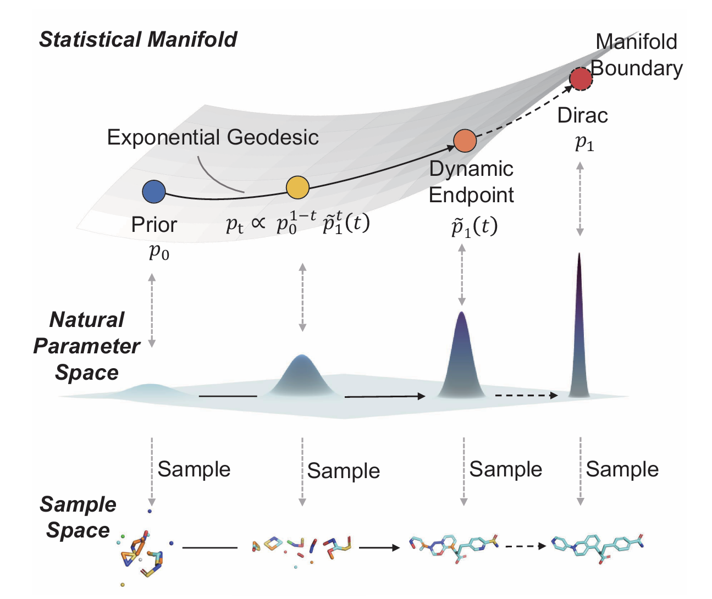

# EvoEGF-Mol

EvoEGF-Mol is an information-geometric generative framework using evolving exponential geodesic flow for structure-based drug design (SBDD). The model supports pocket-specific molecule generation for both de novo design and lead optimization.

Technical details and evaluation results are provided in our paper:
* [EvoEGF-Mol: Evolving Exponential Geodesic Flow for Structure-based Drug Design](https://arxiv.org/abs/2601.22466)


<p align="center">
    
</p>


## Table of Contents
- [EvoEGF-Mol](#evegf)
  - [Table of Contents](#table-of-contents)
  - [Installation](#installation)
  - [Prepare Dataset](#prepare-dataset)
  - [Model weights](#model-weights)
  - [Training](#training)
  - [Inference](#inference)
  - [Evaluation](#evaluation)
  - [License](#license)
  - [Citation](#citation)

[gdrive]: https://drive.google.com/drive/folders/1GscjGciX5GjiynAR0N71iTCZd3C9Qzth

## Installation
You can set up the environment using **either** of the following methods.

---

#### Option 1: Build the environment from scratch

The default CUDA version is 12.4. (The environment is the same as [MolPIF](https://github.com/BLEACH366/MolPIF))

```bash
./setup_env.sh
```

After installation, activate the environment with:
```bash
conda activate evoegfmol
```

#### Option 2: Use the pre-packed environment archive

Alternatively, you can download the pre-built environment archive `evoegfmol_env.tar.gz` we provide from [Google Drive][gdrive], extract the archive and configure environment variables using `conda-unpack`:
```bash
tar -xzf evoegfmol_env.tar.gz -C evoegfmol
./evoegfmol/bin/conda-unpack
```

Then activate the environment with:
```bash
conda activate ./evoegfmol
```

## Prepare Dataset
We use the same data as [MolPilot](https://github.com/GenSI-THUAIR/MolCRAFT/tree/master/MolPilot#data). Data used for training / evaluating the model should be put in the `./data` folder by default.

To train the model from scratch, download the lmdb file and split file into data folder:
* `crossdocked_v1.1_rmsd1.0_pocket10_processed_kekulize.lmdb`
* `crossdocked_pose_split_kekulize.pt`

To evaluate the model on the test set, download and unzip the test_set.zip from [Google Drive][gdrive] into `./data` folder. It includes the original PDB files that will be used in Vina Docking.


## Model weights
Download the `weights` folder from [Google Drive][gdrive] and place it in the project root directory (`./`). You can use the pretrained weight for inference.
- 📂 weights
    - 📂 checkpoints
        - 📄 pretrained.ckpt
    - ⚙️ config.yaml


## Training
To train EvoEGF-Mol, you can modify `./configs/default.yaml` to set some parameters. After this, you can run:
```
python train.py
```
And you will get the intermediate results and the checkpoints in `./logs`.


## Inference

#### General Command

Run molecule generation with:

```bash
python sample_for_pocket.py \
    --protein_path $protein_path \
    --ligand_path $ligand_path \
    --ckpt_path $ckpt_path \
    --out_fn $out_fn
```

Generated molecules will be saved to `$out_fn`.


#### De Novo Design

For de novo molecule generation targeting a specified protein pocket, use the general command above.


#### Lead Optimization

For lead optimization, You can download the `weights_lead` folder from [Google Drive][gdrive] and place it in the project root directory (`./`), it is trained by setting random BFS mask probability parameter `pm` and `pam` in `./configs/default.yaml`. Specify additional fixed-atom information:

```bash
python sample_for_pocket.py \
    --protein_path $protein_path \
    --ligand_path $ligand_path \
    --ckpt_path $ckpt_path \
    --out_fn $out_fn \
    --fix_index $fix_index \
    --attachment_atoms $attachment_atoms \
    --min_add_num $min_add_num
```

Additional arguments:
* `fix_index`: indices of ligand atoms to keep fixed
* `attachment_atoms`: specifies anchor atoms and removes undesired attachment positions
* `min_add_num`: minimum number of added atoms

The `fix_index` can be obtained using:

```bash
python ./test/get_ligand_index.py --sdf $ligand_path
```


#### Quick Example for De Novo Design

You can run:

```bash
python sample_for_pocket.py \
    --ckpt_path weights/checkpoints/pretrained.ckpt
```

Example outputs will be generated in:

```text
./example/output_test
```


## Evaluation
For regular properties (vina score, QED, SA, SE, etc), it is calculated upon sampling. The other evaluation procedure is from [MolGenBench](https://github.com/Intelligent-Drug-Discovery-Lab-TJU/MolGenBench) and [CBGBench](https://github.com/EDAPINENUT/CBGBench/tree/7a34993a8033b0a344ce24cb7c8fb40e5cb73b65); please refer to them for details.

Generated results `EvoEGF-Mol_vina_docked.pt` and `EvoEGF-Mol_metrics.json` can be downloaded from [Google Drive][gdrive].

## License
This project is licensed under the terms of the GPL-3.0 license.


## Citation
```
@article{jin2026evoegfmol,
  title={EvoEGF-Mol: Evolving Exponential Geodesic Flow for Structure-based Drug Design},
  author={Yaowei Jin, Junjie Wang, Cheng Cao, Penglei Wang, Duo An, Qian Shi},
  journal={arXiv preprint arXiv:2601.22466},
  year={2026}
}
```
